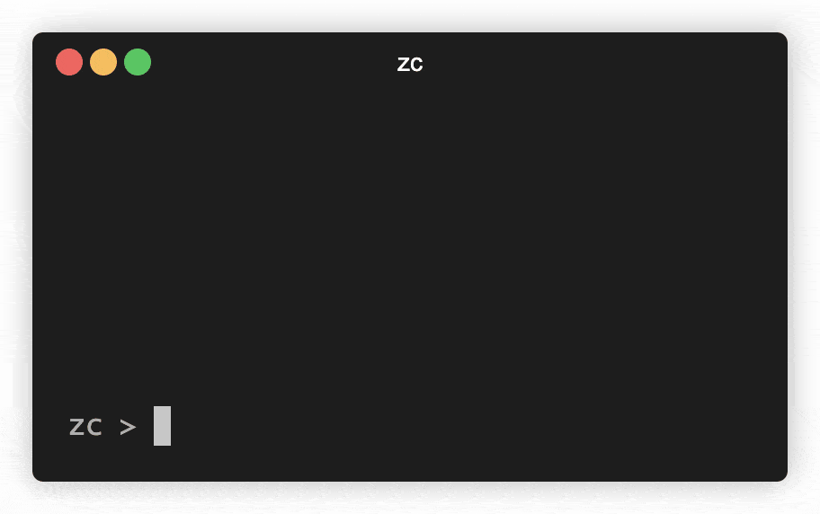

# zc

A fun stack based calculator.

Documentation:

- [operations](doc/ops.md): Operation reference by category
- [index](doc/index.md): Operation names listed alphabetically

When I'm at a terminal prompt and I need to use a calculator, `bc` has always
been my tool of choice. I thought it would be fun to write a calculator myself
but with some items from my wish list built in. Those items are:

- A Stack based calculator. Typing in a value places it on the stack. An
operation consumes values on the stack and places its results back on the
stack.
- To minimize the use of the shift key. Instead of using `+` for addition,
use `add` or `a` which is easier to type.
- Use arbitrary sized integers and fixed point math by default. `1.1 2.2 add`
should be `3.3` and not `3.3000000000000003`.
- Be more than a simple calculator. Need an external tool to lookup, compute,
or calculate? Put it in the calculator as a module instead. Make this
calculator like a Swiss army knife.
- Auto-complete!

This is the third iteration of this calculator and something fun to work on
when time is available. It is a bit rough at this stage but should be useful
nonetheless. Also, it will always be a bit rough--full of bugs and
inconsistencies. Features get added as I need or think of them. Bugs get fixed
or ignored as I see them. There is no grand plan beyond tinkering around for
entertainment. Things may change in backwards incompatible ways with no notice.

## Installation

Use a published binary here:

https://github.com/blackchip-org/zc/releases

or, install [go](https://go.dev/dl/) and then install the calculator with:

    go install github.com/blackchip-org/zc/cmd/zc@latest

Run the calculator with:

    zc

## Overview

Each line entered at the calculator prompt is divided into *words*. Each
word is separated by whitespace. A word can be either a:

- *value*: Starts with a numeric character, a decimal point,
a numeric sign, or quotes. Values are placed onto the stack.
- *operation*: Invokes a operation with the given name. Parameters are consumed
from the stack and results are placed on the stack.

If `2 3 a` is entered at the prompt, the values of `2` and `3` are placed on
the stack, the `a` operation (for addition) is executed, the values are
consumed and the result `5` is placed on the stack.

Examples of calculator use will be presented in a table such as:

<!-- test: simple_addition -->

| Input   | Stack
|---------|-------------
| `2 3 a` | `5`

The *Input* column shows the text entered at the prompt and the *Stack* column
shows the contents of the stack after the line is evaluated. Each word could
have been placed on a separate line:

<!-- test: simple_addition_2 -->

| Input   | Stack
|---------|-------------
| `2`     | `2`
| `3`     | `2 \| 3`
| `a`     | `5`

If there are multiple items on the stack, they are notated by using a pipe `|`
character to separate each item. The item on the right is the top of the stack.

If an operation does not change the stack an informational line may be printed
right above the prompt. This is notated in the table by showing the
information line in italics.

<!-- test: info -->

| Input         | Stack
|---------------|-------------
| `0 seed`      | *seed set to 0*

The basic math functions are:

| Function        | Description |
|-----------------|-------------
| `add`, `a`, `+` | Addition
| `sub`, `s`, `-` | Subtraction
| `mul`, `m`, `*` | Multiplication
| `div`, `d`, `/` | Division

For each of these operations there are three separate names. For addition there
is:

- `a`: Easy to type without having to use the shift key
- `add`: Easy to read in documentation
- `+`: Easy to type if you have a keyboard with a number pad

Additional basic math functions can be found in the [basic](doc/ops/basic.md)
reference.

## Example

Let's compute the distance between two points: `(2, 3)` and `(5, 7)`. The
formula for this uses the Pythagorean theorem:

    dist = sqrt((x2 - x1)^2 + (y2 - y1)^2)

The steps are:

- Compute `x2 - x1`
- Square the result
- Compute `y2 - y1`
- Square the result
- Add them together
- Take the square root

The entry into the calculator looks like the following:

<!-- test: distance -->

| Input     | Stack
|-----------|-------------------
| `5 2 sub` | `3`
| `2 pow`   | `9`
| `7 3 sub` | `9 \| 4`
| `2 pow`   | `9 \| 16`
| `add`     | `25`
| `sqrt`    | `5`

## Commands

These commands are available when running the calculator interactively:

| Command      | Description
|--------------|------------------------------------
| *blank line* | Remove the first item from stack
| `redo`, `r`  | Redo the last undo
| `quit`       | Print the final stack and return to shell
| `undo`, `u`  | Undo the last line entered

## Numbers

Thousand separators are ignored when parsing numbers:

<!-- test: thousands_ignored -->

| Input         | Stack
|---------------|-------------------
| `65,536 sqrt` | `256`

Currency symbols are also ignored when parsing:

<!-- test: currency -->

| Input          | Stack
|----------------|-------------------
| `$1234 2 mul`  | `2468`

Integer math uses arbitrary sized values
(with [math/big](https://pkg.go.dev/math/big)) when possible:

<!-- test: bigint -->

| Input          | Stack
|----------------|-------------------
| `2 128 pow`    | `340282366920938463463374607431768211456`

Real number math uses fixed point math
(with [shopspring/decimal](https://github.com/shopspring/decimal)) when
possible:

<!-- test: decimal -->

| Input          | Stack
|----------------|-------------------
| `1.1 2.2 a`    | `3.3`

Numbers may have a suffix of `f` to use a floating point operation instead:

<!-- test: decimal -->

| Input          | Stack
|----------------|-------------------
| `1.1f 2.2 a`   | `3.3000000000000003`

Enter fractions in `a/b` notation:

<!-- test: fraction -->

| Input          | Stack
|----------------|-------------------
| `1/2 1/4`      | `1/2 \| 1/4`
| `add`          | `3/4`

Prefix a whole number to a fraction with either a space, an underscore, or
a hyphen:

<!-- test: whole-fraction -->

| Input          | Stack
|----------------|-------------------
| `2-1/2 3-1/4`  | `2-1/2 \| 3-1/4`
| `add`          | `5 3/4`

Enter complex numbers in `r+i` notation:

<!-- test: complex -->

| Input          | Stack
|----------------|-------------------
| `1+2i 2+3i`    | `1+2i \| 2+3i`
| `add`          | `3+5i`

## Text

To use text as a value, surround it with quotes. Single quotes, `' '`,
double quotes, `" "` or square brackets, `[ ]` can be used. If the text value is
the only item on the line, an ending quote is not required. The following
computes the length, in characters, of the given text:

<!-- test: text -->

| Input           | Stack
|-----------------|---------------
| `[one thousand` | `one thousand`
| `len`           | `12`

## Higher order functions

The `map` operation can be used to apply a function to each item on the stack.
To use this operation, the top element of the stack should be an expression
to evaluate. Place this expression on the stack using quotes to prevent
immediate evaluation. For example, to double all numbers on the stack:

| Input               | Stack
|---------------------|---------------------|
| `1 2 3 4 5`         | `1 \| 2 \| 3 \| 4 \| 5`
| `[2 mul`            | `1 \| 2 \| 3 \| 4 \| 5 \| 2 mul`
| `map`               | `2 \| 4 \| 6 \| 8 \| 10`

The `fold` function can be used to reduce all items in the stack to a single
value. For example, to sum all the numbers on the stack:

| Input               | Stack
|---------------------|---------------------|
| `1 2 3 4 5`         | `1 \| 2 \| 3 \| 4 \| 5`
| `[add`              | `1 \| 2 \| 3 \| 4 \| 5 \| add`
| `fold`              | `15`

Additional higher-order functions can be found in the [hof](doc/ops/hof.md)
reference.

## To Be Continued...

Still a work in progress.

## Credits

- Fixed point math provided by https://github.com/shopspring/decimal
- CLI auto completion and history provided by https://github.com/peterh/liner
- Geospatial transformations provided by https://github.com/twpayne/go-proj/
- Terminal demo created with https://github.com/faressoft/terminalizer

## License

[MIT](LICENSE)

## Feedback

Contact me at zc@blackchip.org

