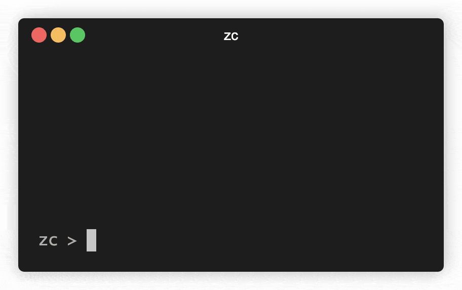

# zc

A fun stack-based calculator.

## Documentation

- [Operation Reference](doc/ops.md)
- [Operations Index](doc/index.md)

## About

When I'm at a terminal prompt and I need to use a calculator, `bc` has always
been my tool of choice. I thought it would be fun to write a calculator myself
but with some items from my wish list built in. Those items are:

- A stack-based calculator. Typing in a value places it on the stack. An
operation consumes values on the stack and places its results back on the
stack.
- To minimize the use of the shift key. Instead of using `+` for addition,
use `add` or `a` which is easier to type.
- Use arbitrary sized integers and fixed point math by default. `1.1 2.2 add`
should be `3.3` and not `3.3000000000000003`.
- Be more than a simple calculator. Need an external tool to lookup, compute,
or calculate? Put it in the calculator as a module instead. Make this
calculator like a Swiss army knife.
- Auto-complete!

This is the third iteration of this calculator and something fun to work on
when time is available. It is a bit rough at this stage but should be useful
nonetheless. Also, it will always be a bit rough--full of bugs and
inconsistencies. Features get added as I need or think of them. Bugs get fixed
or ignored as I see them. There is no grand plan beyond tinkering around for
entertainment. Things may change in backwards incompatible ways with no notice.

## Installation

For the command-line version, install [go](https://go.dev/dl/) and then install
the calculator with:

    go install github.com/blackchip-org/zc/v6/cmd/zc@latest

Run the calculator with:

    zc

## TODO

## License

[MIT](LICENSE)

## Feedback

Contact me at zc@blackchip.org